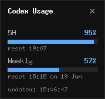

# Codex Usage Monitor

显示 Codex 额度和状态。



## 依赖安装

- 安装 tmux：
  ```bash
  sudo apt install -y tmux
  ```

- 如果悬浮窗无法启动，安装 tkinter：
  ```bash
  sudo apt install -y python3-tk
  ```

## 使用

启动：

```bash
./start_codex_usage.sh
```

停止：

```bash
./stop_codex_usage.sh
```

## 说明

- `start_codex_usage.sh`：启动后台 watcher 和悬浮窗
- `stop_codex_usage.sh`：关闭相关进程和 `tmux` 会话
- `codex_tmux_status_watch.py`：读取 Codex `/status`
- `codex_float_ui.py`：显示浮窗内容
