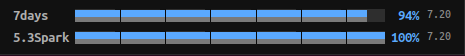

# Codex Usage Monitor

在 GNOME 顶栏显示 Codex 额度和状态。



## 依赖安装

- 安装 tmux：
  ```bash
  sudo apt install -y tmux
  ```

- 如需点击顶栏菜单中的额度曲线，安装 tkinter：
  ```bash
  sudo apt install -y python3-tk
  ```

## 安装顶栏扩展

本扩展支持 GNOME Shell 46。首次使用先运行：

```bash
./install_gnome_extension.sh
```

如果安装脚本提示当前 GNOME 尚未发现扩展，请注销并重新登录，然后运行：

```bash
gnome-extensions enable codex-usage@local
```

顶栏将显示 `codex:85% time:80%`，分别表示剩余额度和当前额度周期的剩余时间。点击它可以查看账户、7 天剩余额度、时间额度、重置时间和更新时间，也可以打开额度曲线。

## 使用

启动：

```bash
./start_codex_usage.sh
```

停止：

```bash
./stop_codex_usage.sh
```

## 说明

- `install_gnome_extension.sh`：把 GNOME 顶栏扩展安装到当前用户目录
- `start_codex_usage.sh`：启动后台 watcher；顶栏扩展会自动读取 watcher 生成的数据
- `stop_codex_usage.sh`：关闭 watcher、旧悬浮窗、已打开的额度曲线和 `tmux` 会话
- `codex_tmux_status_watch.py`：读取 Codex `/status`
- `gnome-extension/codex-usage@local`：显示和更新 GNOME 顶栏项目
- `show_codex_usage_chart.py`：打开当前 7 天额度周期的剩余额度折线图（0–100%），点击窗外或按 Esc 关闭。横轴终点为额度重置时间，起点往前推 7 天；每日凌晨 00:00 为分割线并标注日期，未来时段留空。
- 每次成功采集后保存历史数据，默认位于 `~/.local/state/codex_usage/history.sqlite3`（支持 `XDG_STATE_HOME`）。重启后保留最近 7 天数据；首次启用前的数据无法补回，超过 3 分钟的采集空档不连线。
- 白色表示额度正常，橙色表示额度消耗快于当前 7 天周期，红色表示数据已超过 3 分钟未更新。
- `stop_codex_usage.sh` 只停止数据采集，不会卸载或禁用顶栏扩展；没有数据时扩展显示 `codex:--% time:--%`。
